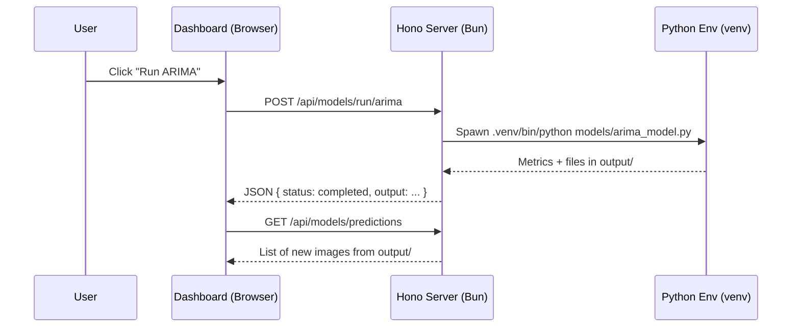

## ML Resource Predictor – Project Report

### 1) Executive Summary
This project forecasts cloud computing resource usage, with a focus on CPU behavior, through a compact and modular machine learning pipeline written in Python and an interactive analytics frontend built with Bun, Hono, and Chart.js. The system covers the complete lifecycle: data preparation and feature engineering, modeling across statistical (ARIMA), deep learning (LSTM), and probabilistic (DeepAR-like) paradigms, and a web interface that lets you explore analytics and trigger model runs. To ensure a smooth demonstration, the repository also includes pre-generated outputs so results can be presented instantly without lengthy training runs.

### 2) Architecture Overview
The backend, implemented in Python, is responsible for data preparation and modeling. Raw or historical metrics are cleaned and transformed into features; models are trained or executed; and the resulting metrics and figures are exported to the `output/` directory. The frontend, implemented as a lightweight Hono server running on Bun, serves a single-page dashboard that reads the processed CSV and visualization artifacts, and exposes simple HTTP endpoints to orchestrate model execution inside the local Python environment. The two layers collaborate through the filesystem and HTTP, striking a balance between simplicity and interactivity.

```mermaid
flowchart LR
  A[Raw VM Metrics] --> B[Data Processing\nfeature engineering]
  B --> C[Processed CSV\noutput/processed_data.csv]
  C --> D[Models: ARIMA / LSTM / DeepAR-like]
  D --> E[Figures & Metrics\noutput/*.png, *.csv]
  E --> F[Web Dashboard\n(Bun + Hono + Chart.js)]
  C --> F
```

### 3) Data Pipeline (Python)
The pipeline ingests timestamped VM metrics and prepares them for modeling. It parses and aligns time series, handles missing values, and derives informative signals such as lags and first differences for CPU, as well as categorical indicators like weekday and weekend flags. The processed dataset is written to `output/processed_data.csv`, which serves both the models and the frontend dashboard. A simple command-line interface allows you to run the processor or any model directly.

```8:15:/Users/adityagarud/OS_LAB/ml_resource_predictor/src/main.py
def main():
    print("Machine Learning Resource Predictor")
    print("==================================")
    print("1. Run data processing")
    print("2. Run ARIMA model")
    print("3. Run LSTM model")
    print("4. Run DeepAR model")
    print("5. Exit")
```

```19:26:/Users/adityagarud/OS_LAB/ml_resource_predictor/src/main.py
    if choice == "1":
        os.system("python src/data_processor.py")
    elif choice == "2":
        os.system("python models/arima_model.py")
    elif choice == "3":
        os.system("python models/lstm_model.py")
    elif choice == "4":
        print("Running DeepAR model...")
```

### 4) Modeling Approaches
The project showcases three complementary forecasting families. ARIMA provides a strong statistical baseline by modeling autocorrelation and trend (after differencing if needed) and is well-suited to univariate series with clear temporal structure; its outputs include predicted versus actual curves and diagnostics such as residual behavior. LSTM introduces a deep learning approach capable of capturing nonlinear dynamics and longer-range dependencies across multiple signals, yielding improved flexibility when relationships deviate from linearity. The DeepAR-like model adds a probabilistic perspective, estimating distributions over future values to communicate uncertainty, which is essential when resource demand varies substantially. Pre-generated artifacts for these models are included so that their behavior can be demonstrated rapidly.

### 5) Frontend and APIs (Bun + Hono)
The frontend is a single-page dashboard that reads the processed CSV and visualization images from the `output/` directory. It exposes JSON endpoints for retrieving tabular data, enumerating visualizations, checking model status, and triggering model runs. When a model is started from the UI, the server invokes the appropriate Python script through the local virtual environment, streams the output, and then refreshes the dashboard to reveal new artifacts.



```12:39:/Users/adityagarud/OS_LAB/ml_resource_predictor/index.ts
// API endpoint to get CSV data
app.get('/api/data', async (c) => {
  try {
    const file = Bun.file('./output/processed_data.csv');
    const text = await file.text();
    const lines = text.split('\n').filter(line => line.trim());
    // ... parse headers and map rows ...
    return c.json({ data, count: data.length });
  } catch (error) {
    return c.json({ error: 'Failed to load data' }, 500);
  }
});
```

### 6) How to Run
To execute the models locally, ensure Python 3.7+ is available, activate the project’s virtual environment, and start the main menu. The CLI offers direct access to the data processor and each model. For the frontend, make sure Bun is installed, then run the Hono server and open the dashboard in a browser.

```bash
cd /Users/adityagarud/OS_LAB/ml_resource_predictor
source .venv/bin/activate
python src/main.py

bun install
bun run index.ts
# Open http://localhost:3000
```

### 7) Validation & Quick Health Check
For a quick readiness pass, the project provides a script that verifies the directory layout, the presence of a local virtual environment, and the availability of key output artifacts. It also exercises a model entry point to confirm execution paths are healthy.

```1:18:/Users/adityagarud/OS_LAB/ml_resource_predictor/final_check.sh
#!/bin/bash

# Final check script for ML Resource Predictor
# Verifies that all components are working correctly

echo "=============================================="
echo "  ML Resource Predictor - Final Check"
```


